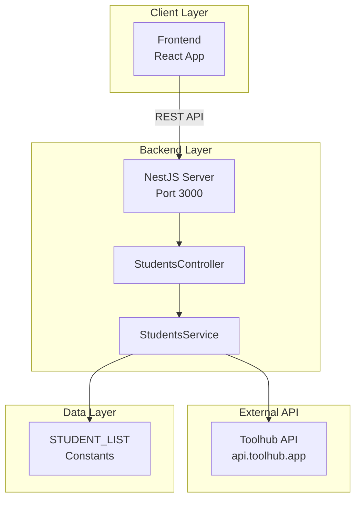
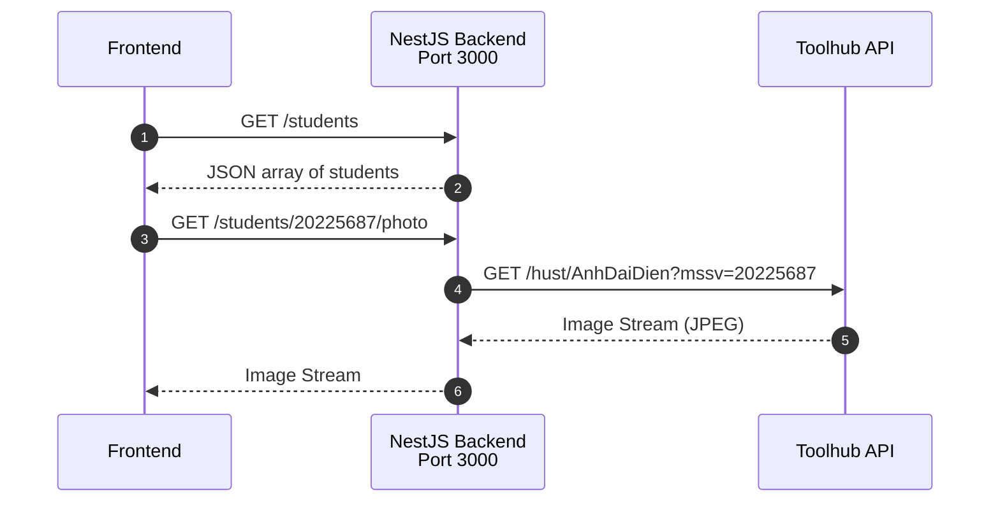
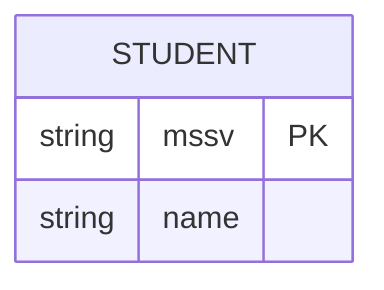

# ClassPortrait Backend

**Backend API cho hệ thống sổ ảnh sinh viên ClassPortrait**

---

## GIỚI THIỆU

**ClassPortrait Backend** là REST API server được xây dựng bằng NestJS, cung cấp các endpoints để quản lý danh sách sinh viên và lấy ảnh đại diện từ hệ thống HUST.

### Tính năng API

- **GET /students**: Lấy danh sách tất cả sinh viên
- **GET /students/:mssv/photo**: Lấy ảnh sinh viên (proxy từ Toolhub API)
- **Swagger Documentation**: API docs tự động tại `/api`
- **CORS**: Cấu hình sẵn cho frontend
- **Stream Processing**: Xử lý ảnh dạng stream để tối ưu memory

---

## TÁC GIẢ

- **Họ tên**: Nguyễn Thị Huyền Trang
- **MSSV**: 20225674
- **Email**: Trang.NTH225674@sis.hust.edu.vn

---

## MÔI TRƯỜNG HOẠT ĐỘNG

### Yêu cầu hệ thống

- Node.js 16.x trở lên
- npm hoặc yarn
- OS: Windows 10/11, macOS 10.15+, Linux (Ubuntu 20.04+)

### Kiến trúc Backend



### Tech Stack

- **Framework**: NestJS 11.0.1
- **Language**: TypeScript 5.7.3
- **HTTP Client**: Axios 1.13.2
- **API Docs**: Swagger/OpenAPI 3.0

---

## HƯỚNG DẪN CÀI ĐẶT VÀ CHẠY THỬ

### Bước 1: Clone repository

```bash
git clone https://github.com/HuyenTranggg/ClassPortrait-backend.git
cd ClassPortrait-backend
```

### Bước 2: Cài đặt dependencies

```bash
npm install
```

### Bước 3: Cấu hình (Optional)

Tạo file `.env` nếu cần custom:

```bash
PORT=3000
FRONTEND_URL=http://localhost:3001
```

### Bước 4: Chạy development server

```bash
npm run start:dev
```

Server sẽ chạy tại: **http://localhost:3000**

### Bước 5: Kiểm tra API

1. **Swagger UI**: http://localhost:3000/api
2. **API Test**:
   ```bash
   # Lấy danh sách sinh viên
   curl http://localhost:3000/students
   
   # Lấy ảnh sinh viên
   curl http://localhost:3000/students/20225687/photo -o test.jpg
   ```

---

## NGUYÊN LÝ CƠ BẢN

### TÍCH HỢP HỆ THỐNG

Backend server hoạt động như một **API Gateway** và **Proxy Server**:



### CÁC THUẬT TOÁN CƠ BẢN

#### 1. Stream Processing cho Images

**Mục đích**: Tiết kiệm memory bằng cách stream ảnh thay vì load toàn bộ vào RAM

```typescript
// Không load vào memory
async getStudentPhoto(mssv: string): Promise<Stream> {
  const response = await axios.get(url, {
    responseType: 'stream',  // ← Stream mode
  });
  return response.data;  // Return stream trực tiếp
}

// Controller pipe stream tới response
@Get(':mssv/photo')
async getPhoto(@Param('mssv') mssv: string, @Res() res: Response) {
  const photoStream = await this.service.getStudentPhoto(mssv);
  photoStream.pipe(res);  // ← Pipe trực tiếp
}
```

**Lợi ích**:
- Memory usage thấp (~constant)
- Response time nhanh hơn
- Xử lý được file lớn

### CẤU TRÚC DỮ LIỆU

#### Cấu trúc dữ liệu hiện tại (Static Data)



**File**: `src/common/constants/student-list.constant.ts`

```typescript
export const STUDENT_LIST: Student[] = [
  { mssv: '20225687' },
  { mssv: '20225596' },
  // ... 50+ students
];
```

**Future**: Migrate sang PostgreSQL/MongoDB khi cần authentication và multi-class

### CÁC PAYLOAD

#### 1. GET /students

**Response** (200 OK):
```json
[
  { "mssv": "20225687" },
  { "mssv": "20225596" },
  { "mssv": "20225786" }
]
```

**Type**:
```typescript
interface Student {
  mssv: string;      // required
  name?: string;     // Optional
}
```

#### 2. GET /students/:mssv/photo

**Parameters**:
- `mssv` (path): Mã số sinh viên

**Response** (200 OK):
- Content-Type: `image/jpeg`
- Body: Binary image stream (~100KB)

**Error Response** (404):
```json
{
  "message": "Không tìm thấy ảnh cho MSSV 11111111",
  "error": "Not Found",
  "statusCode": 404
}
```

---

### ĐẶC TẢ HÀM

#### StudentsController

```typescript
/**
 * Controller xử lý các endpoints liên quan đến sinh viên
 */
@Controller('students')
export class StudentsController {
  
  /**
   * Lấy danh sách tất cả sinh viên
   * @returns {Student[]} Mảng các đối tượng sinh viên
   */
  @Get()
  @ApiOperation({ summary: 'Lấy danh sách tất cả sinh viên' })
  @ApiResponse({ status: 200, description: 'Trả về danh sách sinh viên' })
  findAll(): Student[] {
    return this.studentsService.findAll();
  }

  /**
   * Lấy ảnh đại diện của sinh viên
   * Proxy request tới Toolhub API và stream ảnh về client
   * 
   * @param {string} mssv - Mã số sinh viên
   * @param {Response} res - Express Response object
   * @returns {Promise<void>} Stream ảnh tới response
   * @throws {NotFoundException} Nếu không tìm thấy ảnh
   */
  @Get(':mssv/photo')
  @ApiOperation({ summary: 'Lấy ảnh của sinh viên' })
  @ApiResponse({ status: 200, description: 'Trả về ảnh sinh viên' })
  @ApiResponse({ status: 404, description: 'Không tìm thấy ảnh' })
  async getPhoto(
    @Param('mssv') mssv: string, 
    @Res() res: Response
  ): Promise<void> {
    const photoStream = await this.studentsService.getStudentPhoto(mssv);
    res.setHeader('Content-Type', 'image/jpeg');
    photoStream.pipe(res);
  }
}
```

#### StudentsService

```typescript
/**
 * Service xử lý business logic cho students
 */
@Injectable()
export class StudentsService {
  private students: Student[] = [...STUDENT_LIST];

  /**
   * Trả về danh sách tất cả sinh viên
   * @returns {Student[]} Danh sách sinh viên
   */
  findAll(): Student[] {
    return this.students;
  }

  /**
   * Lấy ảnh sinh viên từ Toolhub API
   * 
   * @param {string} mssv - Mã số sinh viên
   * @returns {Promise<Stream>} Stream dữ liệu ảnh
   * @throws {NotFoundException} Nếu API trả về lỗi
   * 
   * @example
   * const stream = await service.getStudentPhoto('20225687');
   * stream.pipe(response);
   */
  async getStudentPhoto(mssv: string): Promise<Stream> {
    try {
      const url = `https://api.toolhub.app/hust/AnhDaiDien?mssv=${mssv}`;
      const response = await axios.get(url, {
        responseType: 'stream',
      });
      return response.data;
    } catch (error) {
      throw new NotFoundException(`Không tìm thấy ảnh cho MSSV ${mssv}`);
    }
  }
}
```

---

## KẾT QUẢ

### Swagger Documentation


**Truy cập**: http://localhost:3000/api

---

**Frontend**: [Frontend Repo](https://github.com/HuyenTranggg/ClassPortrait-frontend)
