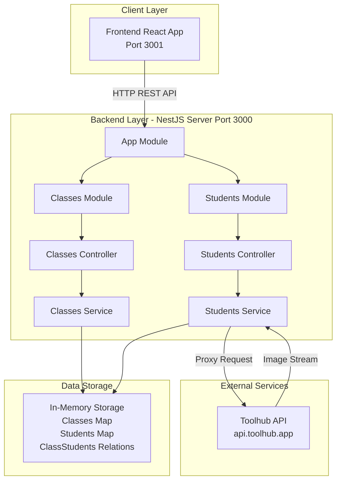
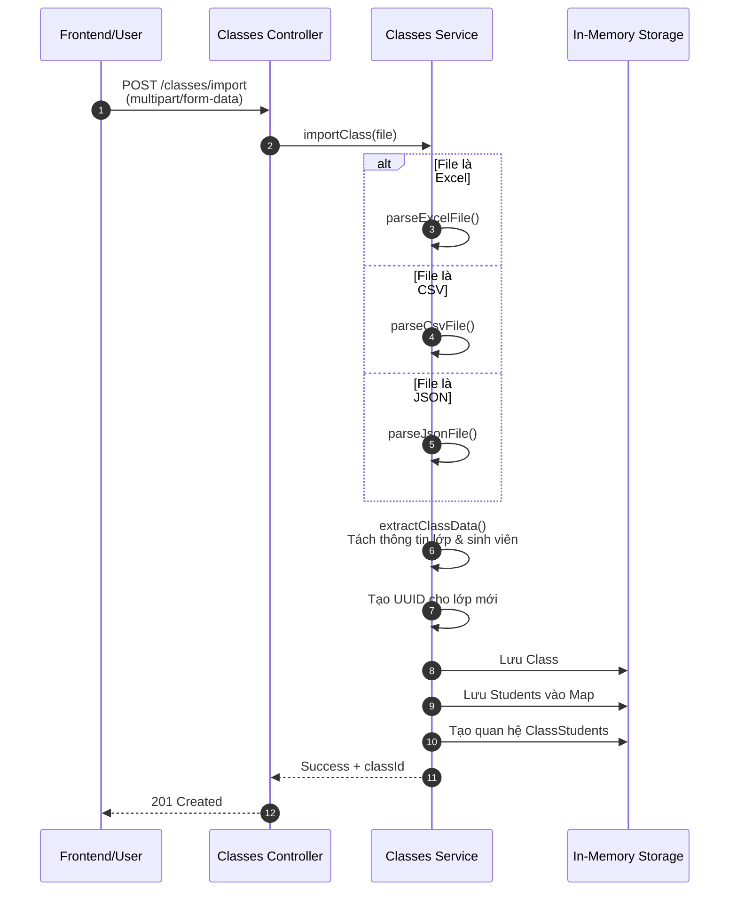
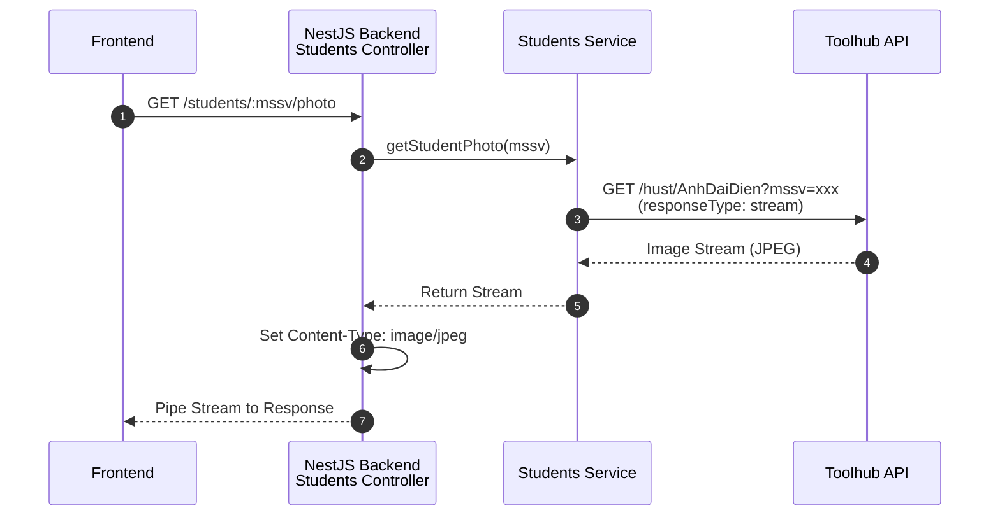
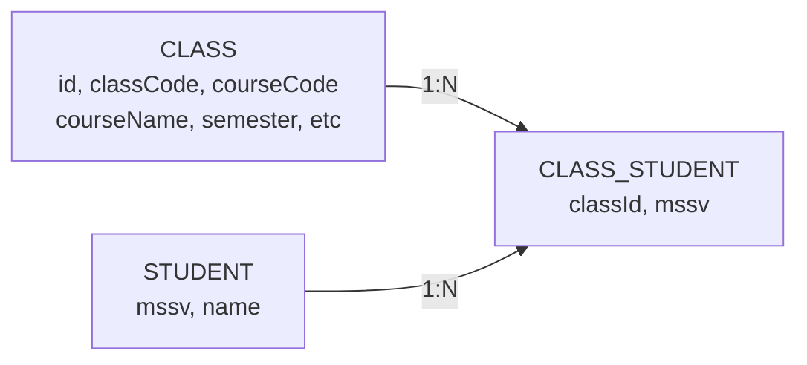
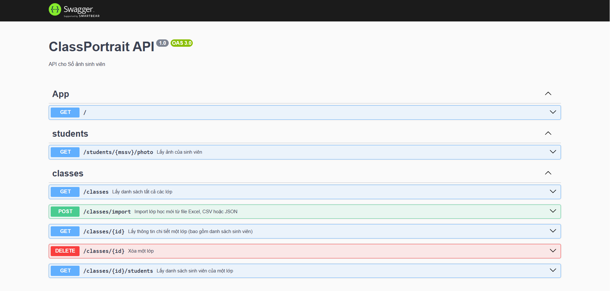

# ClassPortrait Backend

**Backend API cho hệ thống sổ ảnh sinh viên ClassPortrait**

---

## GIỚI THIỆU

**ClassPortrait Backend** là REST API server được xây dựng bằng NestJS, cung cấp các endpoints để quản lý lớp học, danh sách sinh viên và lấy ảnh đại diện từ hệ thống HUST.

### Tính năng chính

- **Quản lý lớp học**: Import lớp học từ file Excel, CSV, JSON với thông tin đầy đủ (mã lớp, mã học phần, tên học phần, giảng viên, học kỳ...)
- **Quản lý sinh viên**: Tự động lưu trữ sinh viên theo quan hệ many-to-many với lớp học
- **Lấy ảnh sinh viên**: Proxy ảnh từ Toolhub API với stream processing để tối ưu memory
- **Swagger Documentation**: API docs tự động tại `/api` với đầy đủ mô tả endpoints
- **Stream Processing**: Xử lý ảnh dạng stream thay vì load vào memory
- **CORS**: Cấu hình sẵn cho frontend

---

## TÁC GIẢ

- **Họ tên**: Nguyễn Thị Huyền Trang
- **MSSV**: 20225674
- **Email**: Trang.NTH225674@sis.hust.edu.vn

---

## MÔI TRƯỜNG HOẠT ĐỘNG

### Yêu cầu hệ thống

- Node.js 16.x trở lên
- npm hoặc yarn
- OS: Windows 10/11, macOS 10.15+, Linux (Ubuntu 20.04+)

### Kiến trúc hệ thống



### Tech Stack

- **Framework**: NestJS 11.0.1
- **Language**: TypeScript 5.7.3
- **HTTP Client**: Axios 1.13.2 (với stream support)
- **File Processing**: xlsx 0.18.5, csv-parser 3.2.0, multer 2.0.2
- **API Documentation**: Swagger/OpenAPI 3.0 (@nestjs/swagger 11.2.1)
- **ID Generation**: UUID 13.0.0

---

## HƯỚNG DẪN CÀI ĐẶT VÀ CHẠY THỬ

### Bước 1: Clone repository

```bash
git clone https://github.com/HuyenTranggg/ClassPortrait-backend.git
cd ClassPortrait-backend
```

### Bước 2: Cài đặt dependencies

```bash
npm install
```

### Bước 3: Cấu hình

Tạo file `.env` nếu cần custom port hoặc CORS:

```bash
PORT=3000
FRONTEND_URL=http://localhost:3001
```

### Bước 4: Chạy development server

```bash
npm run start:dev
```

Server sẽ chạy tại: **http://localhost:3000**

### Bước 5: Kiểm tra API

1. **Swagger UI**: http://localhost:3000/api
2. **API Test**: Sử dụng Swagger UI để gọi thử các API theo hướng dẫn, kiểm tra request/response và đảm bảo các chức năng hoạt động đúng.

---

## NGUYÊN LÝ CƠ BẢN

### TÍCH HỢP HỆ THỐNG

Backend server hoạt động như một **API Gateway**, **File Processor** và **Proxy Server**:

#### Luồng xử lý Import lớp học



#### Luồng xử lý lấy ảnh sinh viên



---

### CÁC THUẬT TOÁN CƠ BẢN

#### 1. UUID Generation cho Class ID

**Mục đích**: Tạo ID unique cho mỗi lớp học, đảm bảo không trùng lặp

```typescript
import { v4 as uuidv4 } from 'uuid';

const newClass: Class = {
  id: uuidv4(),  // Ví dụ: "a3bb189e-8bf9-3888-9912-ace4e6543002"
  classCode: classInfo.classCode,
  // ...
};
```

#### 2. Stream Processing cho Images

**Mục đích**: Tiết kiệm memory bằng cách stream ảnh thay vì load toàn bộ vào RAM

```typescript
// KHÔNG load ảnh vào memory
async getStudentPhoto(mssv: string): Promise<Stream> {
  const response = await axios.get(url, {
    responseType: 'stream',  // ← Chế độ stream
  });
  return response.data;  // Trả về stream trực tiếp
}

// Controller pipe stream tới response
@Get(':mssv/photo')
async getPhoto(@Param('mssv') mssv: string, @Res() res: Response) {
  const photoStream = await this.service.getStudentPhoto(mssv);
  res.setHeader('Content-Type', 'image/jpeg');
  photoStream.pipe(res);  // ← Pipe trực tiếp, không buffer
}
```

**Lợi ích**:
- Memory usage thấp (~constant, không phụ thuộc kích thước ảnh)
- Response time nhanh hơn (không cần đợi download hết)
- Xử lý được file lớn mà không bị out of memory

#### 3. Many-to-Many Relationship với Join Table

**Mục đích**: Mô phỏng quan hệ nhiều-nhiều giữa Class và Student (1 sinh viên có thể học nhiều lớp, 1 lớp có nhiều sinh viên)

```typescript
// Ba bảng lưu trữ riêng biệt
private classes: Class[] = [];                    // Thông tin lớp
private students: Map<string, Student> = new Map(); // Sinh viên (key: mssv)
private classStudents: ClassStudent[] = [];       // Quan hệ (join table)

// Khi thêm sinh viên vào lớp
students.forEach((student) => {
  // Lưu student vào Map (chỉ lưu 1 lần nếu đã tồn tại)
  if (!this.students.has(student.mssv)) {
    this.students.set(student.mssv, student);
  }
  
  // Tạo quan hệ
  this.classStudents.push({
    classId: newClass.id,
    mssv: student.mssv
  });
});
```

---

### THIẾT KẾ DỮ LIỆU
---
Hệ thống sử dụng **In-Memory Storage** với cấu trúc mô phỏng quan hệ nhiều-nhiều (many-to-many):



**Cấu trúc:**

**CLASS** (Lớp học)
- `id` (string): Primary Key - UUID
- `classCode` (string): Mã lớp (required)
- `courseCode` (string): Mã học phần
- `courseName` (string): Tên học phần
- `semester` (string): Học kỳ
- `department` (string): Đơn vị giảng dạy
- `classType` (string): Loại lớp
- `instructor` (string): Giảng viên
- `createdAt` (Date): Thời gian tạo/import

**STUDENT** (Sinh viên)
- `mssv` (string): Primary Key - Mã số sinh viên
- `name` (string): Họ và tên

**CLASS_STUDENT** (Quan hệ)
- `classId` (string): Foreign Key → CLASS.id
- `mssv` (string): Foreign Key → STUDENT.mssv

#### Giải thích

**1. CLASS** - Lưu trữ thông tin lớp học
- `id` (UUID): Primary key, được tạo tự động bằng uuid.v4()
- `classCode` (required): Mã lớp, ví dụ "123456"
- `courseCode`, `courseName`: Thông tin học phần
- `semester`: Học kỳ (ví dụ: "2024.1")
- `department`: Đơn vị giảng dạy (ví dụ: "Viện CNTT")
- `classType`: Loại lớp (LT, BT, TH, LT+BT)
- `instructor`: Tên giảng viên

**2. STUDENT** - Lưu trữ thông tin sinh viên (unique)
- `mssv`: Primary key, mã số sinh viên
- `name`: Họ và tên sinh viên (optional)

**3. CLASS_STUDENT** - Join table, quan hệ nhiều-nhiều
- `classId`: Foreign key tới CLASS.id
- `mssv`: Foreign key tới STUDENT.mssv

#### Implementation trong code

```typescript
// In classes.service.ts
private classes: Class[] = [];                    // Array of Class objects
private students: Map<string, Student> = new Map(); // Map<mssv, Student>
private classStudents: ClassStudent[] = [];       // Array of relations
```

#### Ví dụ về cấu trúc file import Excel

| Mã lớp | Mã học phần | Tên học phần | Học kỳ | ĐV giảng dạy | Loại lớp | GV giảng dạy | MSSV | Họ và tên |
|--------|-------------|--------------|--------|--------------|----------|--------------|------|-----------|
| 123456 | IT3280 | Mạng máy tính | 2024.1 | Viện CNTT | LT+BT | TS. Nguyễn Văn A | 20225674 | Nguyễn Thị Huyền Trang |
| 123456 | IT3280 | Mạng máy tính | 2024.1 | Viện CNTT | LT+BT | TS. Nguyễn Văn A | 20225675 | Trần Văn B |

---

### CÁC PAYLOAD

#### 1. GET /classes

**Mô tả**: Lấy danh sách tất cả các lớp kèm số lượng sinh viên

**Response** (200 OK):
```json
[
  {
    "id": "a3bb189e-8bf9-3888-9912-ace4e6543002",
    "classCode": "123456",
    "courseCode": "IT3280",
    "courseName": "Mạng máy tính",
    "semester": "2024.1",
    "department": "Viện CNTT",
    "classType": "LT+BT",
    "instructor": "TS. Nguyễn Văn A",
    "createdAt": "2026-01-03T10:30:00.000Z",
    "studentCount": 45
  }
]
```

#### 2. POST /classes/import

**Mô tả**: Import lớp học từ file Excel, CSV hoặc JSON

**Request**:
- Method: `POST`
- Content-Type: `multipart/form-data`
- Body:
  ```
  file: <binary file> (Excel/CSV/JSON)
  ```

**Response** (201 Created):
```json
{
  "success": true,
  "classId": "a3bb189e-8bf9-3888-9912-ace4e6543002",
  "message": "Đã import thành công lớp \"123456\" với 45 sinh viên"
}
```

**Error Response** (400 Bad Request):
```json
{
  "message": "Không tìm thấy cột MSSV trong file. Vui lòng đảm bảo có cột tên \"MSSV\", \"mssv\" hoặc \"Mã số sinh viên\"",
  "error": "Bad Request",
  "statusCode": 400
}
```

#### 3. GET /classes/:id

**Mô tả**: Lấy thông tin chi tiết một lớp kèm danh sách sinh viên

**Parameters**:
- `id` (path): UUID của lớp

**Response** (200 OK):
```json
{
  "id": "a3bb189e-8bf9-3888-9912-ace4e6543002",
  "classCode": "123456",
  "courseCode": "IT3280",
  "courseName": "Mạng máy tính",
  "semester": "2024.1",
  "department": "Viện CNTT",
  "classType": "LT+BT",
  "instructor": "TS. Nguyễn Văn A",
  "createdAt": "2026-01-03T10:30:00.000Z",
  "students": [
    {
      "mssv": "20225674",
      "name": "Nguyễn Thị Huyền Trang"
    },
    {
      "mssv": "20225675",
      "name": "Trần Văn B"
    }
  ]
}
```

#### 4. GET /classes/:id/students

**Mô tả**: Lấy danh sách sinh viên của một lớp

**Response** (200 OK):
```json
[
  {
    "mssv": "20225674",
    "name": "Nguyễn Thị Huyền Trang"
  },
  {
    "mssv": "20225675",
    "name": "Trần Văn B"
  }
]
```

#### 5. DELETE /classes/:id

**Mô tả**: Xóa một lớp và tất cả quan hệ với sinh viên

**Response** (200 OK):
```json
{
  "success": true,
  "message": "Đã xóa lớp thành công"
}
```

#### 6. GET /students/:mssv/photo

**Mô tả**: Lấy ảnh đại diện của sinh viên (proxy từ Toolhub API)

**Parameters**:
- `mssv` (path): Mã số sinh viên

**Response** (200 OK):
- Content-Type: `image/jpeg`
- Body: Binary image stream (~100KB)

**Error Response** (404):
```json
{
  "message": "Không tìm thấy ảnh cho MSSV 11111111",
  "error": "Not Found",
  "statusCode": 404
}
```

---

### ĐẶC TẢ HÀM
---
#### ClassesController

```typescript
/**
 * Controller xử lý các endpoints liên quan đến lớp học
 */
@ApiTags('classes')
@Controller('classes')
export class ClassesController {
  
  /**
   * Lấy danh sách tất cả các lớp kèm số lượng sinh viên
   * @returns {Array<Class & { studentCount: number }>} Mảng các lớp với số lượng sinh viên
   */
  @Get()
  @ApiOperation({ summary: 'Lấy danh sách tất cả các lớp' })
  @ApiResponse({ status: 200, description: 'Trả về danh sách các lớp' })
  findAll() {
    return this.classesService.findAllWithStudentCount();
  }

  /**
   * Import lớp học từ file Excel, CSV hoặc JSON
   * 
   * @param {Express.Multer.File} file - File upload (multipart/form-data)
   * @returns {Promise<{ success: boolean, classId: string, message: string }>}
   * @throws {BadRequestException} Nếu file không hợp lệ hoặc thiếu cột MSSV
   */
  @Post('import')
  @HttpCode(HttpStatus.CREATED)
  @UseInterceptors(FileInterceptor('file'))
  @ApiConsumes('multipart/form-data')
  @ApiOperation({ summary: 'Import lớp học mới từ file Excel, CSV hoặc JSON' })
  @ApiResponse({ status: 201, description: 'Import thành công' })
  @ApiResponse({ status: 400, description: 'File không hợp lệ hoặc thiếu cột MSSV' })
  async importClass(@UploadedFile() file: Express.Multer.File) {
    return await this.classesService.importClass(file);
  }

  /**
   * Lấy thông tin chi tiết một lớp kèm danh sách sinh viên
   * 
   * @param {string} id - UUID của lớp
   * @returns {ClassWithStudents} Thông tin lớp kèm danh sách sinh viên
   * @throws {NotFoundException} Nếu không tìm thấy lớp
   */
  @Get(':id')
  @ApiOperation({ summary: 'Lấy thông tin chi tiết một lớp (bao gồm danh sách sinh viên)' })
  @ApiResponse({ status: 200, description: 'Trả về thông tin lớp kèm danh sách sinh viên' })
  @ApiResponse({ status: 404, description: 'Không tìm thấy lớp' })
  findOne(@Param('id') id: string): ClassWithStudents {
    return this.classesService.findOneWithStudents(id);
  }

  /**
   * Xóa một lớp và tất cả quan hệ với sinh viên
   * (Lưu ý: Không xóa sinh viên, chỉ xóa quan hệ)
   * 
   * @param {string} id - UUID của lớp cần xóa
   * @returns {{ success: boolean, message: string }}
   * @throws {NotFoundException} Nếu không tìm thấy lớp
   */
  @Delete(':id')
  @ApiOperation({ summary: 'Xóa một lớp' })
  @ApiResponse({ status: 200, description: 'Xóa thành công' })
  @ApiResponse({ status: 404, description: 'Không tìm thấy lớp' })
  remove(@Param('id') id: string) {
    return this.classesService.remove(id);
  }
}
```

#### ClassesService

```typescript
/**
 * Service xử lý business logic cho classes
 */
@Injectable()
export class ClassesService {
  private classes: Class[] = [];
  private students: Map<string, Student> = new Map();
  private classStudents: ClassStudent[] = [];

  /**
   * Import lớp học từ file
   * Hỗ trợ 3 định dạng: Excel (.xlsx, .xls), CSV (.csv), JSON (.json)
   * 
   * @param {Express.Multer.File} file - File upload từ request
   * @returns {Promise<{ success: boolean, classId: string, message: string }>}
   * @throws {BadRequestException} Nếu file không hợp lệ, thiếu cột bắt buộc, hoặc lỗi parsing
   * 
   * @example
   * // Upload file Excel với các cột: Mã lớp, MSSV, Họ và tên
   * await service.importClass(file);
   * // => { success: true, classId: "uuid", message: "Đã import..." }
   */
  async importClass(file: Express.Multer.File): Promise<{ 
    success: boolean; 
    classId: string; 
    message: string 
  }> {
    // 1. Validate file exists
    // 2. Detect file extension
    // 3. Parse file theo định dạng (Excel/CSV/JSON)
    // 4. Extract class info và students từ data
    // 5. Tạo UUID cho class mới
    // 6. Lưu vào storage (classes, students Map, classStudents relations)
    // 7. Return success với classId
  }

  /**
   * Smart column detection - Tự động nhận diện tên cột
   * Hỗ trợ tiếng Việt (có/không dấu) và tiếng Anh
   * 
   * @private
   * @param {any[]} data - Mảng các row từ file
   * @returns {{ classInfo, students }} Thông tin lớp và danh sách sinh viên
   * @throws {BadRequestException} Nếu thiếu cột MSSV hoặc Mã lớp
   */
  private extractClassData(data: any[]): {
    classInfo: { classCode: string; courseCode?: string; ... };
    students: Student[];
  } {
    // Tìm các cột bằng cách so sánh tên cột (case-insensitive, trim)
    // Hỗ trợ nhiều biến thể: "Mã lớp", "ma lop", "class code", ...
  }
}
```

#### StudentsController & StudentsService

```typescript
/**
 * Lấy ảnh sinh viên từ Toolhub API
 * Sử dụng stream để tối ưu memory
 * 
 * @param {string} mssv - Mã số sinh viên
 * @returns {Promise<Stream>} Stream dữ liệu ảnh
 * @throws {NotFoundException} Nếu API trả về lỗi (MSSV không tồn tại)
 * 
 * @example
 * // Controller usage
 * const photoStream = await service.getStudentPhoto('20225674');
 * res.setHeader('Content-Type', 'image/jpeg');
 * photoStream.pipe(res);  // Stream trực tiếp tới response
 */
async getStudentPhoto(mssv: string): Promise<Stream> {
  const url = `https://api.toolhub.app/hust/AnhDaiDien?mssv=${mssv}`;
  const response = await axios.get(url, { responseType: 'stream' });
  return response.data;
}
```

---

## KẾT QUẢ

### Swagger Documentation

Tài liệu API tự động tạo bởi Swagger, truy cập tại: **http://localhost:3000/api**


---

Backend được thiết kế để tích hợp với Frontend React App:

- **Frontend Repository**: [ClassPortrait-frontend](https://github.com/HuyenTranggg/ClassPortrait-frontend)
- **CORS**: Đã cấu hình cho phép frontend ở port 3001 gọi API
